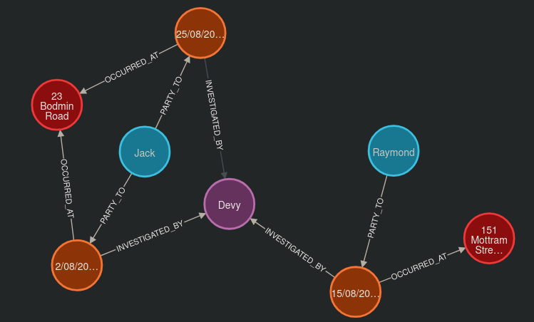
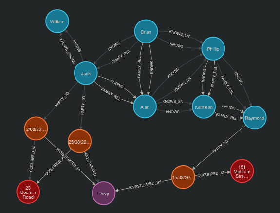

# Activity 5

## Airports

Create a GDS project:
```cypher
call gds.graph.project('routes', 'Airport', 'HAS_ROUTE')
yield graphName, nodeProjection, nodeCount, relationshipProjection, relationshipCount
```

Gather pagerank through route stream:
```cypher
call gds.pageRank.stream('routes')
yield nodeId, score
with gds.util.asNode(nodeId) as n, score as pageRank
return n.iata as iata, n.descr as description, pageRank
order by pageRank desc, iata asc
```

Write then query pagerank:
```cypher
call gds.pageRank.write('routes', { writeProperty: 'pageRank' })
yield nodePropertiesWritten, ranIterations
```
```cypher
match (a:Airport)
return a.iata as iata, a.descr as description, a.pageRank as pageRank
order by a.pageRank desc, a.iata asc
```

Process communities of Airports:
```cypher
// Uncovering distinct clusters or communities of nodes, shedding light on cohesive groups or substructures within a graph. 
CALL gds.louvain.stream('routes')
YIELD nodeId, communityId
WITH gds.util.asNode(nodeId) AS n, communityId
RETURN
    communityId,
    SIZE(COLLECT(n)) AS numberOfAirports,
    COLLECT(DISTINCT n.city) AS cities
ORDER BY numberOfAirports DESC, communityId;
```

Similarities:
```cypher
// Node similarity
CALL gds.nodeSimilarity.stream('routes')
YIELD node1, node2, similarity
WITH gds.util.asNode(node1) AS n1, gds.util.asNode(node2) AS n2, similarity
RETURN
    n1.iata AS iata,
    n1.city AS city,
    COLLECT({iata:n2.iata, city:n2.city, similarityScore: similarity}) AS similarAirports
ORDER BY city LIMIT 20
```
```cypher
//Node similarity: topN and bottomN
CALL gds.nodeSimilarity.stream(
    'routes',
    {
        topK: 1,
        topN: 10
    }
)
YIELD node1, node2, similarity
WITH gds.util.asNode(node1) AS n1, gds.util.asNode(node2) AS n2, similarity AS similarityScore
RETURN
    n1.iata AS iata,
    n1.city AS city,
    {iata:n2.iata, city:n2.city} AS similarAirport,
    similarityScore
ORDER BY city
```

Weighted graph with Dijsktra:
```cypher
//Creating a weighted graph projection
call gds.graph.project(
    'routes-weighted',
    'Airport',
    'HAS_ROUTE',
    {
        relationshipProperties: 'distance'
    }
)
yield graphName, nodeProjection, nodeCount, relationshipProjection, relationshipCount
```
```cypher
//Dijkstra’s algorithm: calculating the shortest path given a source node
MATCH (source:Airport {iata: 'DEN'})
MATCH (target:Airport {iata: 'MEL'})
CALL gds.shortestPath.dijkstra.stream('routes-weighted', {
    sourceNode: source,
    targetNode: target,
    relationshipWeightProperty: 'distance'
})
YIELD index, sourceNode, targetNode, totalCost, nodeIds, costs, path
RETURN
    index,
    gds.util.asNode(sourceNode).iata AS sourceNodeName,
    gds.util.asNode(targetNode).iata AS targetNodeName,
    totalCost,
    [nodeId IN nodeIds | gds.util.asNode(nodeId).iata] AS nodeNames,
    costs,
    nodes(path) as path
ORDER BY index
```

## Crime investigation

Give me the details of all the Crimes under investigation by Officer Larive (Badge Number 26-5234182):
```cypher
match (o:Officer {badge_no: "26-5234182"})<-[i:INVESTIGATED_BY]-(c:Crime) return o,i,c
```

Only drug crimes under investigation:
```cypher
match (o:Officer {badge_no: "26-5234182"})<-[i:INVESTIGATED_BY]-(c:Crime {type: "Drugs", last_outcome: "Under investigation"})
return o,i,c
```

For those crimes, display the locations and people involved in to find similarities:
```cypher
match (o:Officer {badge_no: "26-5234182"})<-[i:INVESTIGATED_BY]-(c:Crime {type: "Drugs", last_outcome: "Under investigation"}),
(c)-[:OCCURRED_AT]->(l:Location),
(c)<-[:PARTY_TO]-(p:Person)
return o,i,c,l,p
```


Display the people that know eachother:
```cypher
match (o:Officer {badge_no: "26-5234182"})<-[i:INVESTIGATED_BY]-(c:Crime {type: "Drugs", last_outcome: "Under investigation"}),
(c)-[:OCCURRED_AT]->(l:Location),
(c)<-[:PARTY_TO]-(p:Person),
(p)<-[:KNOWS]->(k:Person)
return o,i,c,l,p,k
```
