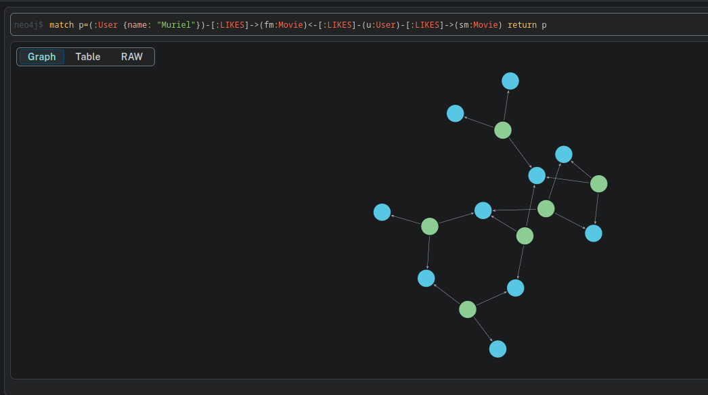

# Activity 6

## Query #1: Recommend movies liked by similar users.
Recommend movie to "Muriel" based on similar users liked.

First we build the query and check what it looks like:
```cypher
match p=(:User {name: "Muriel"})-[:LIKES]->(fm:Movie)<-[:LIKES]-(u:User)-[:LIKES]->(sm:Movie) return p
```


Then we find the most "recommended" movies using the number of watchers:
```cypher
match (muriel:User {name: "Muriel"})-[:LIKES]->(fm:Movie)<-[:LIKES]-(u:User)-[:LIKES]->(sm:Movie)
where not (sm)<-[:LIKES]-(muriel)
with sm, count(sm) as nbWatched, collect(u.name) as watchers
order by nbWatched desc
return sm, nbWatched, watchers
```


## Query #2: Recommend movies based on genre
If we know that Vincent likes science fiction how can we recommend movies in the same genre?

*NB: we don't recommend Sci-Fi movies that Vincent has already watched*

Proposed solution:
```cypher
match (m:Movie {genre: "Sci-Fi"})
where not (m)<-[:LIKES]-(:User {name: "Vincent"})
return m
```
