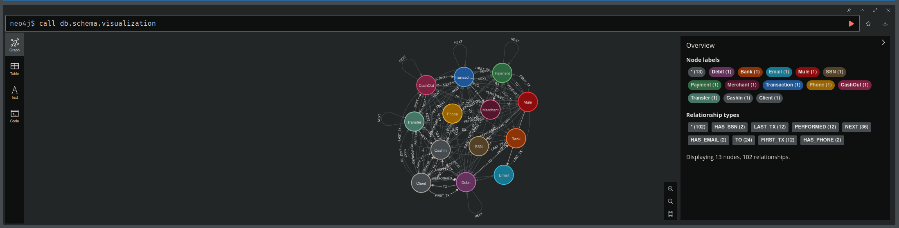
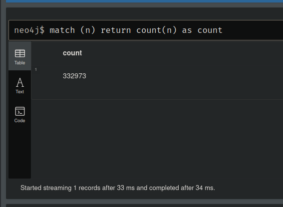
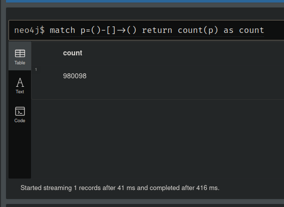
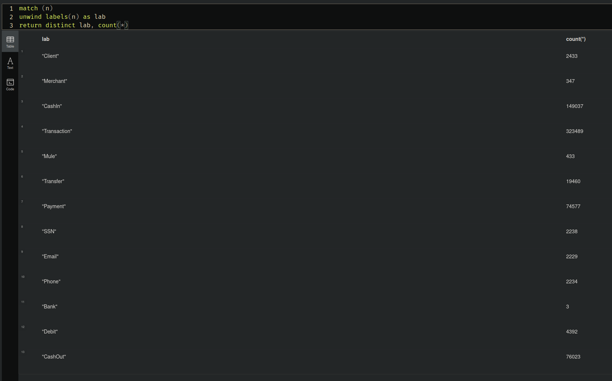
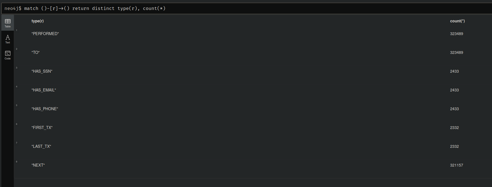

# Final exam

## Preparation: Analyzing the fraud detection dataset

Schema Visualization:



Nodes Count:



Relationships Count:



Node Labels and their Count:



Relationship Types and their Count:



## Task

*The Spark file used for this task is [SparkExam.scala](../spark/Spark/src/main/scala/SparkExam.scala)*

Question 5. Find out what types of transactions do these Clients perform with first party fraudsters?
```cypher
match (:Client:FirstPartyFraudster)-[]-(t:Transaction)-[]-(c:Client)
where not c:FirstPartyFraudster
unwind labels(t) as lab
return lab, count(t);
```

Question 6. How many clusters of FraudRings with greater than 9 client nodes.
```cypher
match (c:Client)
where c.firstPartyFraudGroup is not null
with c.firstPartyFraudGroup as clusterId, collect(c.id) as fraudsters
with *, size(fraudsters) as fsize
where fsize > 9
return clusterId, fsize
```

Question 7. How many clusters of FraudRings with greater than 10 client nodes.
```cypher
match (c:Client)
where c.firstPartyFraudGroup is not null
with c.firstPartyFraudGroup as clusterId, collect(c.id) as fraudsters
with *, size(fraudsters) as fsize
where fsize > 10
return clusterId, fsize
```
