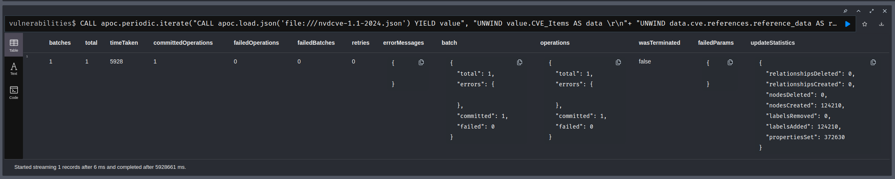
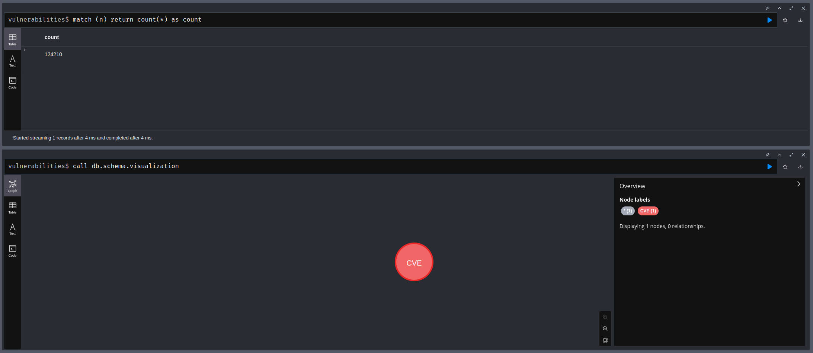

# Activity 3: CVE


Load the JSON file using APOC:

```cypher
call apoc.load.json("apoc.json") yield value
```


To use the Python connector, in the [connector folder](../connector/)

Write the variables to the env file:
```ini
NEO4J_URI=bolt://localhost:7687
NEO4J_USER=neo4j
NEO4J_PASSWORD=example
```


Then use the connector to load the JSON and return the CVE count:
```cypher
WITH "file:///nvdcve-1.1-2018.json" as url 
CALL apoc.load.json(url) YIELD value 
UNWIND  value.CVE_Items as cve
RETURN count (cve)
```


Import as nodes:
```cypher
CALL apoc.periodic.iterate("CALL apoc.load.json('file:///nvdcve-1.1-2024.json') YIELD value",
"UNWIND  value.CVE_Items AS data  \r\n"+
"UNWIND data.cve.references.reference_data AS references \r\n"+
"MERGE (cveItem:CVE {uid: apoc.create.uuid()}) \r\n"+
"ON CREATE SET cveItem.cveid = data.cve.CVE_data_meta.ID, cveItem.references = references.url",
 {batchSize:100, iterateList:true});
```

Result:


