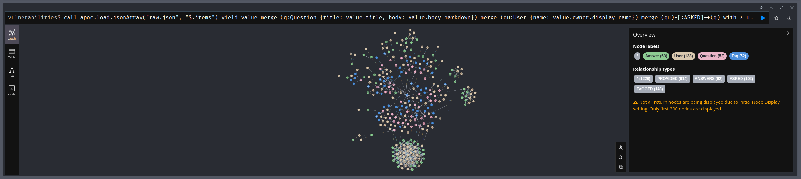
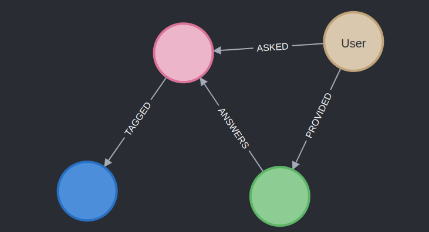

# Activity 4: StackOverflow

First, let's parse the raw JSON in steps:

```cypher
call apoc.load.jsonArray("raw.json", "$.items") yield value
```

Test with separated answers:
```cypher
call apoc.load.jsonArray("raw.json", "$.items")
yield value
unwind value.answers as answer
return value, answer
```

Now using merge on separated answers:
```cypher
call apoc.load.jsonArray("raw.json", "$.items")
yield value
unwind value.answers as answer
merge (a:Answer {title: answer.title, body: answer.body_markdown})
merge (au:User {name: answer.owner.display_name})
merge (au)-[:PROVIDED]->(a)
return *
```

Now, merging the question before separating answers:
```cypher
call apoc.load.jsonArray("raw.json", "$.items")
yield value
merge (q:Question {title: value.title, body: value.body_markdown})
merge (qu:User {name: value.owner.display_name})
merge (qu)-[:ASKED]->(q)
with *
unwind value.answers as answer
merge (a:Answer {title: answer.title, body: answer.body_markdown})
merge (au:User {name: answer.owner.display_name})
merge (au)-[:PROVIDED]->(a)
return *
```

Joining the answer to the question, and adding tags:
```cypher
call apoc.load.jsonArray("raw.json", "$.items")
yield value
merge (q:Question {title: value.title, body: value.body_markdown})
merge (qu:User {name: value.owner.display_name})
merge (qu)-[:ASKED]->(q)
with *
unwind value.answers as answer
merge (a:Answer {title: answer.title, body: answer.body_markdown})
merge (au:User {name: answer.owner.display_name})
merge (au)-[:PROVIDED]->(a)
merge (a)-[:ANSWERS]->(q)
with *
unwind value.tags as tag
merge (t:Tag {text: tag})
merge (q)-[:TAGGED]->(t)
return *
```

This gives us the final result:


